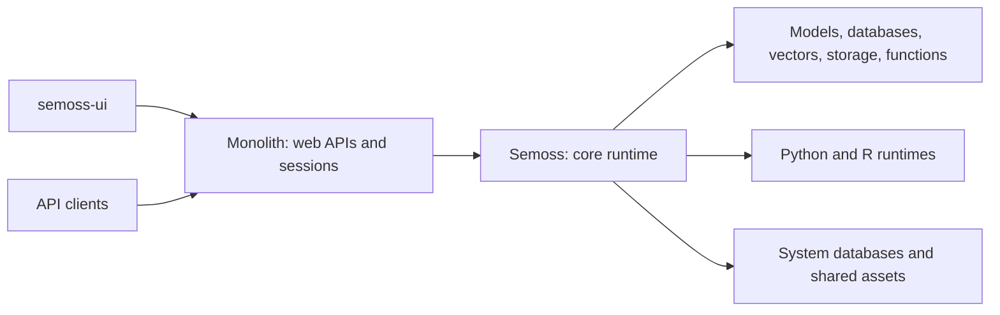

# SEMOSS

**An open source platform for building AI applications, connecting data, and running analytics.**

SEMOSS (Semantic Open Source Software) brings models, databases, vector stores, storage providers, and custom functions into a common framework. Use it to build AI assistants and applications, work with enterprise data, and create repeatable analytical workflows through a web interface, APIs, or code.

This repository contains the **core SEMOSS runtime**: the Java execution engine, Pixel language and reactors, engine integrations, Python and R components, and container build definitions. [Monolith](https://github.com/SEMOSS/Monolith) exposes the runtime through a web application and APIs, and [semoss-ui](https://github.com/SEMOSS/semoss-ui) provides the user interface.

[Documentation](docs/README.md) · [Docker quick start](#quick-start-with-docker) · [Build from source](#building-from-source) · [Complete deployment examples](https://github.com/SEMOSS/SEMOSS-deployment) · [Issues](https://github.com/SEMOSS/Semoss/issues)

## Contents

- [Capabilities](#capabilities)
- [Architecture and related repositories](#architecture-and-related-repositories)
- [Quick start with Docker](#quick-start-with-docker)
- [Weekly IL4 development build](#weekly-il4-development-build)
- [Complete deployments](#complete-deployments)
- [Core concepts](#core-concepts)
- [Building from source](#building-from-source)
- [Running tests](#running-tests)
- [Configuration](#configuration)
- [Repository layout](#repository-layout)
- [Documentation](#documentation)
- [Troubleshooting](#troubleshooting)
- [Contributing and support](#contributing-and-support)
- [License](#license)

## Capabilities

- **AI and model integration.** Connect language and embedding models through a shared engine interface. Combine model calls with data retrieval, functions, and application workflows.
- **Data access and analytics.** Query connected databases, combine data from multiple sources in frames, transform results, and use them in applications, notebooks, and automated workflows.
- **Vector search and retrieval.** Ingest documents and connect vector databases for semantic search and retrieval augmented generation.
- **Applications and automation.** Build applications, agents, and reusable workflows using Pixel, Java reactors, Python, R, and custom functions or APIs.
- **Shared access controls.** Manage access to engines, projects, and insights, with platform services for authentication, permissions, model usage logging, and auditing.
- **Flexible deployment.** Run locally with Docker Compose or deploy multiple application nodes with shared databases, object storage, and Redis or ZooKeeper coordination.

Available integrations and runtime features depend on the engines and services configured in your installation.

## Architecture and related repositories



Monolith packages the core runtime as a Java dependency in its WAR. These are layers of the application; the diagram does not require a separate service for each box.

| Repository | Responsibility | Start here |
| --- | --- | --- |
| **[Semoss](https://github.com/SEMOSS/Semoss)** — this repository | Core execution, connectors, data processing, and runtime assets | [Backend documentation](docs/README.md) |
| **[Monolith](https://github.com/SEMOSS/Monolith)** | Java web application, HTTP APIs, authentication integration, sessions, and WebSockets | [README and local development](https://github.com/SEMOSS/Monolith#readme) |
| **[semoss-ui](https://github.com/SEMOSS/semoss-ui)** | Frontend applications and shared UI libraries | [Frontend setup](https://github.com/SEMOSS/semoss-ui#readme) |
| **[SEMOSS-deployment](https://github.com/SEMOSS/SEMOSS-deployment)** | Complete Kubernetes deployment examples and infrastructure configuration | [Deployment guide](https://github.com/SEMOSS/SEMOSS-deployment#readme) |

For a ready-to-run local platform, use the Docker examples below. To run backend code changes, use [Monolith's local Docker examples](https://github.com/SEMOSS/Monolith/tree/dev/local-docker-testing/local-docker-compose).

## Weekly IL4 development build

[Build IL4 test container](.github/workflows/il4-container.yml) runs every Monday
at **09:23 UTC** once installed on this repository's default branch. Scheduled
runs explicitly check out `IL4-dev`; they do not build or merge `dev` application
code. The same workflow supports path-filtered pushes and manual runs on
`IL4-dev`.

This is a development-only build using the existing
`codebuild-semoss-github-runner` project and repository secrets
`REPO_ONE_USERNAME` / `REPO_ONE_PASSWORD`, without an environment approval gate.
The existing SEMOSS Ubuntu/Quay job-tooling image is digest-pinned; the
published application's three base images remain Iron Bank images.
The job installs Ubuntu's `python3` package for build orchestration only.
Each run refreshes the digests behind the existing Iron Bank Maven `3.9.16`,
UBI `10.2`, and Python `v3.14` tags and builds without cache. It does not
automatically advance version tags or the locked SEMOSS release.

After offline checks pass, the exact tested image is published to
`ghcr.io/semoss/semoss-il4` with a source-commit/run-specific tag. The run summary
records the deployable digest and resolved base images. See the
[IL4-dev build and deployment guide](https://github.com/SEMOSS/Semoss/blob/IL4-dev/docker/il4/README.md)
for runner prerequisites, BC-FIPS TLS configuration, and acceptance limitations.
This workflow does not deploy the image or establish IL4 authorization.

## Quick start with Docker

The quickest way to try SEMOSS is the [Docker Compose examples](docker-compose-examples/README.md). They use a published SEMOSS image containing the web application and UI, so no local Java or frontend build is required.

### Prerequisites

- Git.
- Docker with a running daemon and Docker Compose v2 (`docker compose`).
- Access to pull container images, including the SEMOSS image from Quay.io.
- Available host ports **9090** for SEMOSS and **5432** for PostgreSQL.

### Start a single node

```bash
git clone https://github.com/SEMOSS/Semoss.git
cd Semoss/docker-compose-examples

# Create the shared network if it does not already exist.
docker network inspect semoss-net >/dev/null 2>&1 || docker network create semoss-net

docker compose -f semoss-with-postgres.yml up -d
docker compose -f semoss-with-postgres.yml logs -f semoss
```

Wait for application startup, then open **[http://localhost:9090/#/](http://localhost:9090/#/)**. The example enables native registration for local use; follow the application's account setup and sign-in flow. PostgreSQL credentials in the Compose file are database credentials, not a SEMOSS user account.

This stack starts SEMOSS and PostgreSQL, initializes the system databases using [init.sql](docker-compose-examples/init.sql), and persists application data in named Docker volumes. Python is enabled and R is disabled in these examples.

Check the stack or stop it from the same directory:

```bash
docker compose -f semoss-with-postgres.yml ps
docker compose -f semoss-with-postgres.yml down
```

`down` retains named volumes. Adding `-v` deletes those volumes and their data.

### Choose an example

| Compose file | Topology | Application URLs |
| --- | --- | --- |
| [semoss-with-postgres.yml](docker-compose-examples/semoss-with-postgres.yml) | One SEMOSS node and PostgreSQL | `http://localhost:9090/#/` |
| [semoss-with-postgres-minio.yml](docker-compose-examples/semoss-with-postgres-minio.yml) | One node, PostgreSQL, and MinIO shared asset storage | `http://localhost:9090/#/` |
| [semoss-with-postgres-minio-redis.yml](docker-compose-examples/semoss-with-postgres-minio-redis.yml) | Two nodes, PostgreSQL, MinIO, and Redis synchronization | Ports `9090` and `9091` |
| [semoss-with-postgres-minio-zk.yml](docker-compose-examples/semoss-with-postgres-minio-zk.yml) | Two nodes, PostgreSQL, MinIO, and ZooKeeper synchronization | Ports `9090` and `9091` |

Use the selected filename with `docker compose -f`. Run one platform example at a time: the stacks share fixed container names and host ports, including with Monolith's local examples. Stop the current stack before switching. Cluster variants use service names `semoss1` and `semoss2` for logs.

The [Compose guide](docker-compose-examples/README.md) documents supporting service ports, storage behavior, and configuration. The examples use development images and local credentials; configure credentials, authentication, and network exposure for your deployment before making it accessible to others.

### Add supporting engines

The [engine examples](docker-compose-examples/engines/README.md) provide optional services and connection instructions for vector databases, ClickHouse, object storage, SFTP, and mail functions. Start only the services you need, then configure the corresponding engine in SEMOSS. These examples share the `semoss-net` Docker network with the platform examples.

## Complete deployments

For Kubernetes and infrastructure deployment, or semoss-artifacts property configuration, see [SEMOSS-deployment](https://github.com/SEMOSS/SEMOSS-deployment).

## Core concepts

| Concept | Purpose | Documentation |
| --- | --- | --- |
| **Pixel** | Language for expressing data operations, application actions, and execution workflows | [Pixel language](docs/concepts/pixel_language.md) |
| **Reactors** | Java implementations of operations invoked by Pixel | [Reactor framework](docs/concepts/reactor_framework.md) |
| **Engines** | Common abstraction for databases, models, vector stores, storage, and functions | [Engine abstraction](docs/concepts/engine_abstraction.md) |
| **Frames and query structures** | Represent data and describe queries and transformations | [DataFrames and QueryStructs](docs/concepts/data_frames_and_query_struct.md) |
| **Insights** | Hold execution context, results, and analytical state | [The Insight object](docs/concepts/insight_object.md) |
| **Projects** | Organize application assets and reusable work | [Project engines](docs/engines/project_engines.md) |

A typical request travels from semoss-ui or an API client through Monolith to the core runtime. Pixel operations invoke reactors, which use engines and frames to perform the work. Results return through Monolith to the caller. See the [backend architecture](docs/01_backend_architecture_overview.md) and [Monolith integration](docs/integrations/monolith_interaction.md).

## Building from source

### Requirements

Use **JDK 21** and **Apache Maven 3.9.x**; the Java compiler targets 21 and CI uses Maven 3.9.9. Git and access to the Maven repositories declared in [pom.xml](pom.xml) are also required. Check the active toolchain with `java -version` and `mvn -version`.

From the repository root:

```bash
mvn clean install
```

This compiles the core, runs the default test selection, creates artifacts under `target/`, and installs them into your local Maven repository. For a build that skips test execution:

```bash
mvn clean install -DskipTests
```

The default `dev` profile is intended for local development. The `deploy` profile adds release packaging and signing steps; it is not needed for a local build. The development build also configures the repository's [Git hooks](hooks/README.md).

### Run your changes through Monolith

Keep the two repositories next to each other:

```text
workspace/
├── Semoss/
└── Monolith/
```

Build Semoss before Monolith. Their `ci.version` values must match because Monolith depends on `org.semoss:semoss` with the `shaded-dependencies` classifier. A successful `mvn install` here makes that artifact available to the local Monolith build.

Follow [Monolith's Docker quick start](https://github.com/SEMOSS/Monolith#quick-start-with-docker) to build both repositories and run the resulting `local-monolith` image. The published-image examples in this repository do not include unbuilt local source changes. Frontend development is documented in [semoss-ui](https://github.com/SEMOSS/semoss-ui#readme).

## Running tests

Run these commands from the repository root:

```bash
# Run the default unit test selection.
mvn test

# Run one test class.
mvn -Dtest=YearReactorUnitTests test

# Run verification, including the configured JaCoCo report step.
mvn verify
```

The default Maven profile selects `**/*UnitTests.java` from [test/](test/). This is not a promise that every integration test or external service is exercised. Tests for specific integrations may require additional services and configuration. Surefire results are written to `target/surefire-reports/`, and JaCoCo reports to `target/site/jacoco/` when generated.

## Configuration

The running application uses a SEMOSS home directory for configuration, engine definitions, projects, and runtime assets. Container startup translates supported environment variables into the application's configuration; use the checked-in Compose files as concrete examples.

| Configuration area | Where to look |
| --- | --- |
| Core runtime, feature flags, and engine settings | [RDF_Map.prop](RDF_Map.prop) and [configuration guide](docs/development_guides/configuration_and_environment.md) |
| Login and identity provider settings | [social.properties](social.properties) and [authentication and authorization](docs/platform_services/authentication_and_authorization.md) |
| Application logging | [log4j2.xml](log4j2.xml) |
| System databases | [Internal databases](docs/platform_services/internal_databases.md) and [Compose initialization SQL](docker-compose-examples/init.sql) |
| Local Docker ports, networks, volumes, and service connections | [Local Docker configuration](docs/deployment/docker_configuration.md) and [Compose examples](docker-compose-examples/README.md) |
| Container startup and semoss-artifacts property configuration | [SEMOSS-deployment](https://github.com/SEMOSS/SEMOSS-deployment) |
| Shared storage and cluster operation | [Cloud and cluster documentation](docs/cloud_and_cluster/README.md) and [deployment examples](https://github.com/SEMOSS/SEMOSS-deployment) |

In the examples, `CUSTOM_*` variables configure the system databases; `SETSOCIAL`, `ENABLE_NATIVE`, and `REDIRECT` configure local login behavior; `NETTY_PYTHON` and `NATIVE_PY_SERVER` enable Python integration. MinIO variants add shared storage configuration, and the two-node variants add a coordination backend. Preserve the database names and connection settings consistently with the initialization SQL.

## Repository layout

| Path | Contents |
| --- | --- |
| [src/prerna/reactor/](src/prerna/reactor/) | Pixel operations and application logic |
| [src/prerna/sablecc2/](src/prerna/sablecc2/) | Pixel parsing and execution support |
| [src/prerna/engine/](src/prerna/engine/) | Engine interfaces and integrations |
| [src/prerna/ds/](src/prerna/ds/) and [src/prerna/query/](src/prerna/query/) | Frames, query structures, and query interpretation |
| [src/prerna/auth/](src/prerna/auth/) | Identity and permission services |
| [src/prerna/cluster/](src/prerna/cluster/) | Shared storage and cluster coordination |
| [py/](py/), [R/](R/), and [js/](js/) | Language runtime components and supporting scripts |
| [test/](test/) | Java tests and test resources |
| [docker/](docker/) | Runtime and application image build definitions |
| [docker-compose-examples/](docker-compose-examples/) | Local platform stacks and supporting engine examples |
| [docs/](docs/README.md) | Architecture, concepts, integrations, and development guides |
| [hooks/](hooks/README.md) and [dev-scripts/](dev-scripts/README.md) | Contributor tooling |

## Documentation

Start with the [documentation index](docs/README.md), then choose a path:

- **Understand the runtime:** [architecture](docs/01_backend_architecture_overview.md), [Pixel](docs/concepts/pixel_language.md), and [engine abstractions](docs/concepts/engine_abstraction.md).
- **Extend the platform:** [write a reactor](docs/how-to-guides/writing_custom_reactors.md), [work with databases](docs/how-to-guides/interacting_with_databases.md), or [use frames](docs/how-to-guides/working_with_dataframes.md).
- **Build AI integrations:** [model engines](docs/engines/model_engines.md), [vector engines](docs/engines/vector_engines.md), [GenAI client](docs/python_genai_client/README.md), and [Python GAAS tools](docs/python_gaas_tools/README.md).
- **Develop the web application:** [Monolith](https://github.com/SEMOSS/Monolith) and [semoss-ui](https://github.com/SEMOSS/semoss-ui).
- **Operate the platform:** [Docker examples](docker-compose-examples/README.md) and [complete deployment examples](https://github.com/SEMOSS/SEMOSS-deployment).

## Troubleshooting

| Symptom | What to check |
| --- | --- |
| Compose reports that `semoss-net` does not exist | Create the external network using the quick-start command. |
| A container name or port is already in use | Stop the other SEMOSS or Monolith example; check for a local PostgreSQL service on port 5432. |
| The UI is unavailable during first startup | Check `docker compose -f semoss-with-postgres.yml ps` and logs for both `semoss` and `db`; image downloads and database initialization can take time. |
| Login redirects to the wrong address | Match `REDIRECT` to the browser-facing URL and check authentication and cookie settings. |
| PostgreSQL settings changed but the old configuration remains | PostgreSQL initialization scripts run only on a fresh data directory. Update the existing database explicitly or recreate disposable development data. |
| Java compilation reports an unsupported release | Confirm `mvn -version` uses JDK 21. |
| Local changes do not appear in the running application | Build the core and Monolith, rebuild `local-monolith`, and recreate its container using Monolith's development workflow. |

## Contributing and support

Bug reports, documentation improvements, tests, and new integrations are welcome. Use [Semoss issues](https://github.com/SEMOSS/Semoss/issues) for core runtime problems, [Monolith issues](https://github.com/SEMOSS/Monolith/issues) for web/API problems, and [semoss-ui issues](https://github.com/SEMOSS/semoss-ui/issues) for frontend problems.

For a change, keep the scope focused, include relevant tests and documentation, and describe the behavior and validation in your pull request. Follow the [commit message conventions](hooks/README.md). When reporting a bug, include the revision or image tag, deployment topology, reproduction steps, and relevant logs with credentials and private data removed.

## License

See [LICENSE](LICENSE) for the Apache License 2.0 terms. Retain applicable source-file and third-party dependency notices when redistributing the software.
