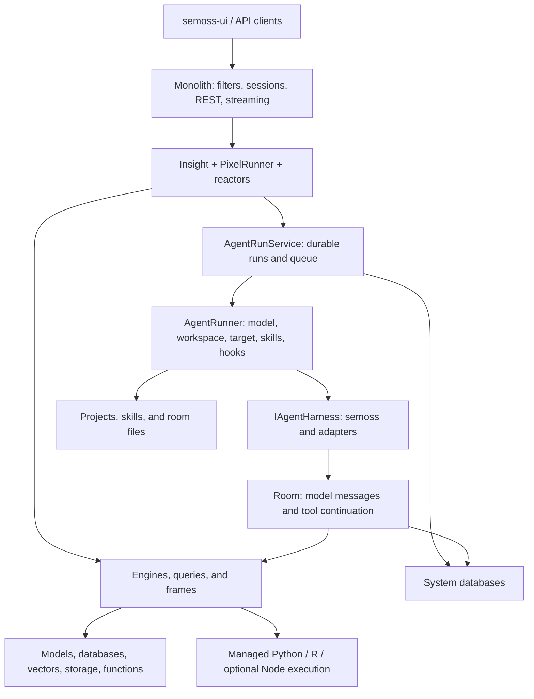
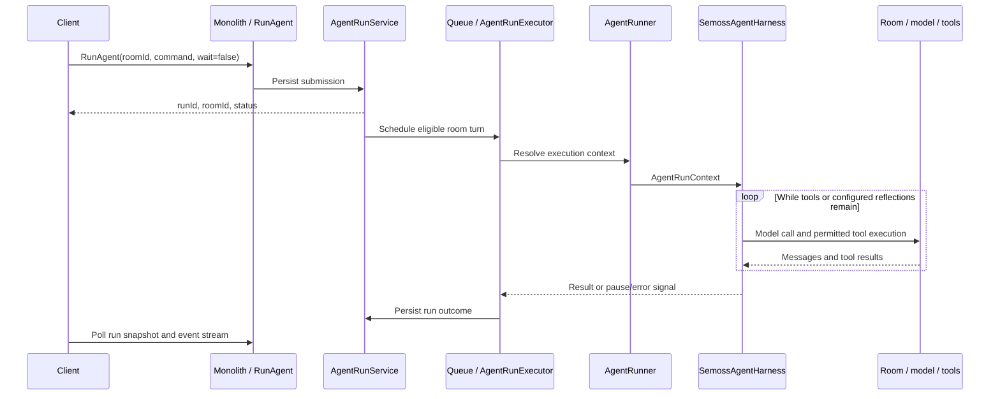

# SEMOSS Backend Architecture

The backend combines a Java web application, a programmable core runtime, persistent conversation and agent services, and connectors to external systems. The core lives in [Semoss](https://github.com/SEMOSS/Semoss); [Monolith](https://github.com/SEMOSS/Monolith) hosts it in Tomcat and exposes it to [semoss-ui](https://github.com/SEMOSS/semoss-ui) and other clients.

## Application layers

These are logical layers. The native harness, reactors, rooms, and core engine services run inside the Java application; model providers and some language workers are separate processes or services.

## Core components

| Component | Responsibility | Source |
| --- | --- | --- |
| Monolith REST application | Register API resources and integrate request/session handling | [MonolithApplication](https://github.com/SEMOSS/Monolith/blob/dev/src/prerna/semoss/web/app/MonolithApplication.java) |
| Insight | Execution context: user, project association, variables, frames, and language workers | [Insight](../src/prerna/om/Insight.java) |
| Pixel execution | Parse expressions, translate them into operations, and collect results | [PixelRunner](../src/prerna/sablecc2/PixelRunner.java), [GreedyTranslation](../src/prerna/sablecc2/GreedyTranslation.java) |
| Reactors | Implement operations with typed inputs and `NounMetadata` results | [ReactorFactory](../src/prerna/reactor/ReactorFactory.java), [reactor framework](concepts/reactor_framework.md) |
| Engines | Common resource lifecycle plus specialized database/model/storage/etc. interfaces | [IEngine](../src/prerna/engine/api/IEngine.java) |
| Projects | Application assets, project types, and reusable agent/skill packages | [IProject](../src/prerna/project/api/IProject.java), [Project](../src/prerna/project/impl/Project.java) |
| Frames and query structures | Represent data and express queries across supported backends | [Frame and query guide](concepts/data_frames_and_query_struct.md) |
| Agent services | Persist, schedule, execute, pause, and cancel agent runs | [AgentRunService](../src/prerna/reactor/agent/run/AgentRunService.java) |
| Room | Persistent conversation, model calls, and tool-result continuation | [Room](../src/prerna/engine/impl/model/Room.java) |

## HTTP and Pixel request flow

1. A request reaches Monolith, normally under `/Monolith`. Servlet/filter mappings in [web.xml](https://github.com/SEMOSS/Monolith/blob/dev/WebContent/WEB-INF/web.xml) handle the configured login, session, and request checks.
2. RESTEasy dispatches the request to a registered resource. The common Pixel endpoint is `POST /Monolith/api/engine/runPixel`, implemented by [NameServer](https://github.com/SEMOSS/Monolith/blob/dev/src/prerna/semoss/web/services/local/NameServer.java).
3. The endpoint resolves the user's Insight and execution context. `Insight.runPixel(...)` delegates expressions to `PixelRunner` and the translation/reactor machinery.
4. Reactors read inputs, check the permissions required by the operation, and use engines, frames, projects, or platform services. Authentication at the web boundary does not replace resource authorization inside these operations.
5. Results are represented by `NounMetadata` and serialized into the Pixel response. Long-running operations can expose asynchronous progress through their dedicated APIs.

The current web layer uses Jakarta APIs. Servlet classes from older Java EE descriptions are not the entry point for this flow. See [Monolith integration](integrations/monolith_interaction.md).

Provider events enter through dedicated servlet applications: GitHub posts to `/Monolith/github/webhook`, and Microsoft Graph posts to `/Monolith/msgraph/notifications/messages` or `/Monolith/msgraph/notifications/events`. GitHub dispatches repository synchronization; Microsoft receivers currently fetch and log changed resources. These receivers use provider-specific verification and background executors. See [webhooks and subscription management](integrations/monolith_webhooks.md) for their endpoints, persistence, and execution boundaries.

## Agent execution flow

`RunAgent` is a reactor with a durable execution lifecycle beyond the submitting HTTP request:

The worker admits runs in room order, obtains local room ownership, optionally obtains a Redis turn lease, and claims the durable run before starting it on a virtual thread. `AgentRunner` resolves the model, working target, workspace configuration, staged skills, and lifecycle hooks before invoking `IAgentHarness`.

The default [SemossAgentHarness](../src/prerna/reactor/agent/runtime/SemossAgentHarness.java) owns prompt composition, tool rounds, optional reflections, compaction, and run message tagging. [HarnessToolExecutor](../src/prerna/reactor/agent/runtime/HarnessToolExecutor.java) handles tool batches, hooks, delegation, and approval pauses. Other registered harnesses adapt Claude Code and GitHub Copilot Python; native-loop features should not be assumed for every adapter.

Detailed behavior is documented in [the harness guide](agents/semoss_harness.md) and [run lifecycle and streaming](agents/agent_runs.md).

## Agent identity, skills, and execution targets

An agent is a project with type `WORKSPACE`, supplemented by configuration in the model-inference database's `WORKSPACE` and `WORKSPACE_RESOURCE` tables. The configuration includes instructions, MCP resources, skills, model defaults, and runtime limits. Project permissions govern access to the reusable agent.

A skill is a project with type `SKILL`. Its instructions and supporting assets live under the project's assets directory. [SkillStager](../src/prerna/reactor/agent/skill/SkillStager.java) materializes attached skills under the run target's `.claude/skills/`; [SkillScanner](../src/prerna/reactor/agent/skill/SkillScanner.java) supplies the available-skill catalog. `LoadSkill` retrieves instructions and reference files on demand.

The agent workspace identifies **which agent to run**. The `space` argument and resolved working directory identify **where it works**: a room/insight folder, the user's assets, or an editable target project. These identifiers are not interchangeable. See [agent configuration](agents/agent_configuration.md).

## Persistence and state boundaries

| State | Storage and lifetime |
| --- | --- |
| Engine/project catalog and permissions | Security database; project types distinguish applications, agents, and skills |
| Workspace configuration and attachments | Model-inference database: `WORKSPACE`, `WORKSPACE_RESOURCE`, and `CONFIG_JSON` |
| Room conversation | Model-inference database: `ROOM.MESSAGES`, accessed through `RoomMessageStore` |
| Agent lifecycle and pending actions | Model-inference database: `AGENT_RUN` and `AGENT_RUN_ACTION` |
| Model usage and inference records | Model-inference database, separate from the conversation projection |
| Project, skill, engine, and room files | SEMOSS home assets, with central object storage in configured cloud mode |
| Frames, worker variables, and live request credentials | Process/session runtime state; not automatically recovered from an agent run record |
| Live agent item events | Bounded, process-local stream buffer drained by a client |
| Optional room cache and coordination | Redis; the persisted room messages remain authoritative |

System databases can use embedded or external database configurations. The checked-in Docker examples use PostgreSQL. The model-inference database is required for the persistent room, workspace, and agent services described here; it is more than a collection of optional usage counters.

A durable run record does not mean arbitrary running work can migrate after a process restart. Ordinary submissions retain live execution credentials on the submitting node. Specific background continuation paths have recovery support. See [run lifecycle limitations](agents/agent_runs.md#durability-and-cluster-behavior).

## Language execution and tool boundaries

Java invokes managed language workers through the runtime integration layer. [Python communication](platform_services/java_python_communication.md) covers sockets, translators, and the Python server; [Python GAAS tools](python_gaas_tools/README.md) expose SEMOSS resources to Python code. The native agent's Python and optional Node tools use managed execution contexts. Their variables can persist while the worker is alive; files are needed for durable outputs.

Tool availability depends on deployment settings, workspace policy, attached resources, and caller permissions. Skills and prompt instructions do not create new permissions. Filesystem target checks, tool policy, approval decisions, and configured process sandboxing serve different purposes; sandbox enforcement depends on the selected runtime and deployment configuration.

## Cloud and cluster operation

[CentralCloudStorage](../src/prerna/cluster/util/clients/CentralCloudStorage.java) synchronizes asset files through a configured storage backend. [ClusterSynchronizerFactory](../src/prerna/cluster/sync/impl/ClusterSynchronizerFactory.java) selects Redis or ZooKeeper for asset-change coordination.

Asset synchronization is distinct from room-message coordination, agent turn leases, HTTP sessions, and live event buffers. Enabling object storage or ZooKeeper alone does not make every runtime state shared. The [cluster guide](cloud_and_cluster/README.md) explains these boundaries and links complete deployment examples.

## Where to go next

- [Agents, harnesses, and skills](agents/README.md)
- [Engine abstraction](concepts/engine_abstraction.md) and [project types](engines/project_engines.md)
- [Internal databases](platform_services/internal_databases.md) and [authentication/authorization](platform_services/authentication_and_authorization.md)
- [Developer onboarding](development_guides/java_developer_onboarding.md) and [configuration](development_guides/configuration_and_environment.md)
- [Docker examples](../docker-compose-examples/README.md), [Monolith local builds](https://github.com/SEMOSS/Monolith#quick-start-with-docker), and [complete deployments](https://github.com/SEMOSS/SEMOSS-deployment)
