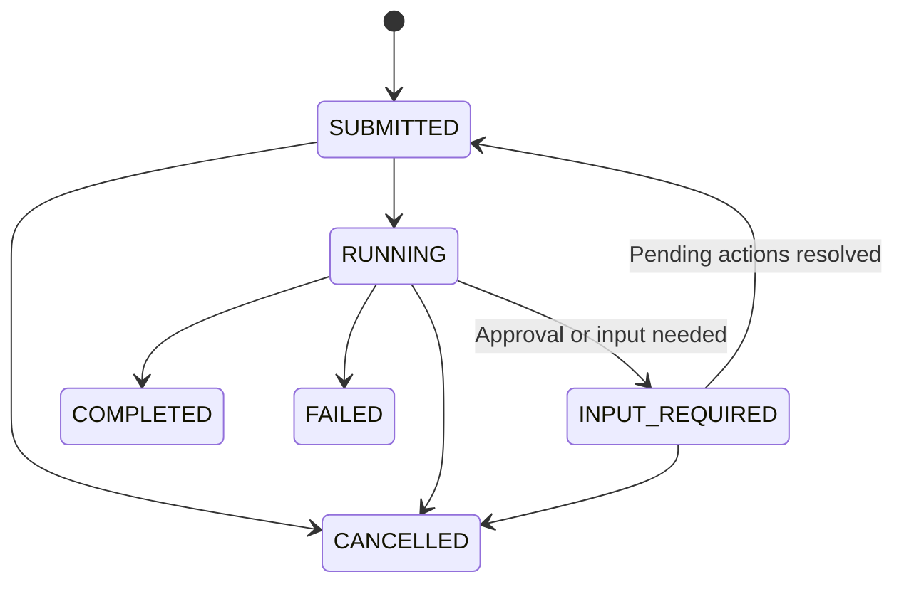

# Agent Runs, Persistence, and Streaming

`RunAgent` submits a durable unit of work associated with a room. Run records, room messages, pending actions, and live events are separate data structures with different lifetimes.

## Submit and inspect a run

Run these templates in an authenticated SEMOSS context, replacing the identifiers:

```pixel
RunAgent(
    roomId=["<room-id>"],
    command=["Summarize the files in this workspace."],
    engine=["<model-engine-id>"],
    workspaceId=["<workspace-id>"],
    harnessType=["semoss"],
    maxTurns=[10],
    wait=[false]
);
```

The asynchronous result has this shape:

```json
{
  "runId": "<run-id>",
  "roomId": "<room-id>",
  "status": "SUBMITTED"
}
```

Use the returned run ID rather than a Pixel job ID to monitor the agent:

```pixel
GetAgentRun(runId=["<run-id>"], includeMessages=[true]);
GetAgentRunsForRoom(roomId=["<room-id>"]);
```

`GetAgentRun` returns durable status, output, message IDs, errors, and pending actions. `includeMessages` adds the run's room-message projection. The owning user is checked when accessing run records.

### Submission parameters

| Key | Behavior |
| --- | --- |
| `roomId`, `command` | Required room and user task |
| `engine` | Explicit model selection; otherwise resolve from room/workspace configuration |
| `workspaceId` | Agent configuration for this run |
| `harnessType` | Default `semoss`; explicit unknown names fail before persistence |
| `space` | File target; see [agent configuration](agent_configuration.md) |
| `maxTurns`, `maxReflections` | Native-loop limits, subject to workspace caps |
| `paramValues` | Model parameters and supported runtime options such as `max_seconds` and `subdir` |
| `agentParams` | Agent-specific parameters available to configuration/hooks |
| `media` / `image`, `url` | Initial media inputs, only when supported by the selected harness |
| `wait` | Defaults to `true`; `false` returns a submission handle |
| `waitTimeoutMs` | Waiting deadline; zero/omitted uses the server setting |

Synchronous waiting returns when the run completes, fails, is cancelled, reaches `INPUT_REQUIRED`, or the wait times out. A timeout returns the current snapshot; it does not cancel the run. Browser clients should generally submit asynchronously and monitor progress.

## Lifecycle



| Status | Meaning |
| --- | --- |
| `SUBMITTED` | Persisted and waiting for an eligible execution turn |
| `RUNNING` | Claimed by a worker |
| `INPUT_REQUIRED` | Paused on persisted pending actions; execution can resume |
| `COMPLETED` | Final result recorded |
| `FAILED` | Execution failed; inspect the recorded error |
| `CANCELLED` | Cancellation recorded |

`INPUT_REQUIRED` ends a synchronous wait but is not a completed task. The same run can be re-submitted internally for continuation after decisions are recorded.

[AgentRunQueueLoop](../../src/prerna/reactor/agent/run/AgentRunQueueLoop.java) starts the oldest eligible submitted turn for a room. Admission combines an in-process room claim, an optional Redis lease, and an atomic durable status update. [AgentRunExecutor](../../src/prerna/reactor/agent/run/AgentRunExecutor.java) classifies the harness result and records the outcome.

## Approval and input pauses

A tool marked `SMSS_MCP_EXECUTION=ask` creates an approval boundary. The harness records pending actions in `AGENT_RUN_ACTION`; each action carries its run, room, tool call, arguments, metadata, decision state, and result.

1. The run becomes `INPUT_REQUIRED` and returns pending action information.
2. The client can read a specific action with `GetAgentRunAction(actionId=["<action-id>"])`.
3. The decision path through [RunMCPToolReactor](../../src/prerna/reactor/agent/mcp/RunMCPToolReactor.java) and [AgentToolDecisionHandler](../../src/prerna/reactor/agent/mcp/AgentToolDecisionHandler.java) validates the persisted action and caller.
4. `approve` and `edit` execute the authorized tool. `reject` and `respond` record the supplied decision/result without executing that tool.
5. Once the pending batch is decided, the worker resumes the native harness from the tool results. It owns the subsequent model call.

Already-decided actions have replay handling. Clients should use the persisted action IDs and the current decision API rather than fabricate tool results or submit another copy of the user's task.

## Live event polling

Monolith exposes:

```text
POST /Monolith/api/engine/agentRunStreaming
Content-Type: application/x-www-form-urlencoded

runId=<run-id>
```

Use the session and CSRF handling required by the deployment. This endpoint returns JSON; it is a polling endpoint, not an SSE subscription. The response shape is:

```json
{
  "run": { "runId": "<run-id>", "status": "RUNNING" },
  "events": [],
  "droppedEvents": 0
}
```

The `run` object is the authorized durable snapshot. `events` contains buffered `item.started`, `item.updated`, and `item.completed` events for message, reasoning, tool, and subagent items. Fields depend on the item kind and provider support.

[AgentRunStreamService](../../src/prerna/reactor/agent/stream/AgentRunStreamService.java) currently retains up to 2,000 events per run. Polling **drains** the events, so the stream assumes a single consumer. Terminal buffers expire after a grace period, currently 60 seconds. Overflow increments `droppedEvents`; rebuild the display from the durable snapshot/messages when deltas are missing.

Canonical stream sessions currently cover `semoss` and `claude_code`. Other harnesses can have durable run status without these events. Do not use `/pixelJobStreaming` as the agent event feed.

## Cancellation

```pixel
StopAgentRun(runId=["<run-id>"]);
```

Cancellation records the durable state and signals active execution. Interruption and cancellation checks cooperate with the harness and tools; cancellation cannot undo external effects already performed. A client that stops polling has not cancelled the run.

## Durability and cluster behavior

| State | Authoritative location |
| --- | --- |
| Run request, status, final output, and progress | `AGENT_RUN` in the model-inference database |
| Pending tool decisions | `AGENT_RUN_ACTION` in the same database |
| Conversation projection | `ROOM.MESSAGES`, accessed through `RoomMessageStore` |
| Working files and skill copies | Resolved room/user/project assets, with configured cloud synchronization |
| Live deltas | Memory of the application node producing them |
| Live credentials and execution context | The submitting node's `InsightHandle` |

The Redis room turn lease is controlled by `AGENT_RUN_QUEUE_ENABLED` and requires Redis to be enabled. Its default follows Redis availability. `AGENT_RUN_ACTIVE_TTL_MS` controls the renewable lease lifetime. ZooKeeper asset synchronization is a different feature and does not supply this lease.

Ordinary submissions are node-affine because live user tokens are not persisted. Some server-owned continuation and child-completion paths can reconstruct context after restart; this is not a general guarantee that arbitrary active user runs resume on another node. Routing must also account for node-local HTTP/session state and live event buffers.

## Troubleshooting

| Symptom | Check |
| --- | --- |
| Agent or room persistence is unavailable | Model-inference database initialization and `MODEL_INFERENCE_LOGS_ENABLED` |
| Run stays `SUBMITTED` | Earlier room turns, active room ownership, Redis lease configuration, and availability of the submitting execution context |
| Run stays `INPUT_REQUIRED` | Pending actions; all decisions in the batch must be settled before continuation |
| Polling has no events | Harness support, polling node, a second consumer, buffer expiration, and the durable run status |
| UI missed part of the output | `droppedEvents` and the durable message projection |
| Model selection fails | Model access, model type/capability, room model, and workspace default |
| Agent finishes without expected files | Tool results and the resolved target; a final text claim alone is not evidence of a write |

See [AgentRunService](../../src/prerna/reactor/agent/run/AgentRunService.java), [AgentRunStore](../../src/prerna/reactor/agent/run/AgentRunStore.java), [RoomMessageStore](../../src/prerna/engine/impl/model/RoomMessageStore.java), and [Monolith's NameServer](https://github.com/SEMOSS/Monolith/blob/dev/src/prerna/semoss/web/services/local/NameServer.java) for the implementation.
