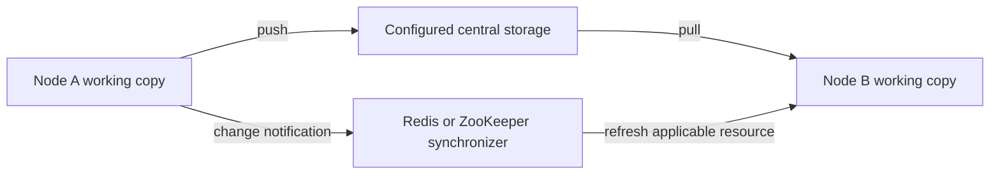

# Central Storage for SEMOSS Assets

[CentralCloudStorage](../../src/prerna/cluster/util/clients/CentralCloudStorage.java) manages shared asset files through a configured storage backend. Application nodes keep working copies and use push/pull operations to synchronize them with central storage.

This storage is distinct from system database tables, live JVM state, and transient agent event buffers.

## What is stored

- Engine configuration and associated files.
- Project files, including application, WORKSPACE agent, and SKILL project assets.
- Saved insight files and project-specific resources.
- User assets and room folders where the corresponding synchronization path is used.

The implementation defines storage namespaces and paths for the different asset types. Use [ClusterUtil](../../src/prerna/cluster/util/ClusterUtil.java) and the storage helpers rather than duplicating their path conventions in application code.

## Transfer flow

`CentralCloudStorage` supplies resource-specific operations for engines, projects, insights, user assets, and room files. Storage provider setup chooses the underlying implementation. Supported deployment examples include MinIO/S3-compatible storage and cloud-provider storage configurations.

Notifications and file transfers are separate operations. A direct edit to a local file is not evidence that a matching push and notification occurred.

## Locking boundaries

[EngineSyncUtility](../../src/prerna/util/EngineSyncUtility.java) and [ProjectSyncUtility](../../src/prerna/util/ProjectSyncUtility.java) provide local resource locks used during synchronization. A JVM `ReentrantLock` is not a distributed lock across application nodes. Coordinate cross-node behavior through the configured synchronization implementation and the resource's supported mutation path.

## Agents and skills

The agent runner resolves a file target and stages attached skill packages into that target's `.claude/skills/` directory. The source skill project remains the canonical package. Its staged copy is a working copy that can be refreshed during later runs.

After agent execution, configured cloud-mode paths push the target and room assets through the runner's synchronization lifecycle. Conversation history, run status, and approval decisions are persisted separately in the model-inference database. Redis room caches and agent event buffers are not substitutes for either store.

See [skill staging](../agents/skills/skills_doc.md#runtime-staging-and-loading) and [agent state boundaries](../agents/agent_runs.md#durability-and-cluster-behavior).

## Local and complete examples

- [Single node with PostgreSQL and MinIO](../../docker-compose-examples/semoss-with-postgres-minio.yml)
- [Two nodes with Redis](../../docker-compose-examples/semoss-with-postgres-minio-redis.yml)
- [Two nodes with ZooKeeper](../../docker-compose-examples/semoss-with-postgres-minio-zk.yml)
- [Complete deployment examples](https://github.com/SEMOSS/SEMOSS-deployment)

Inspect the selected example's volumes and storage settings when planning persistence. The MinIO examples use object storage for shared assets; that is different from the named application volumes used by the basic local stack.
