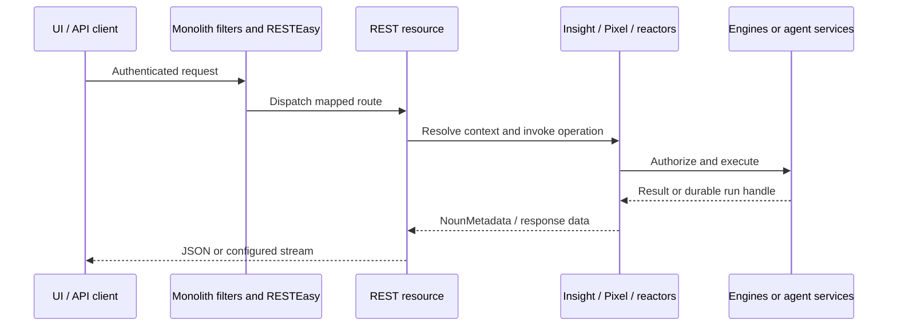

# Semoss and Monolith Integration

[Monolith](https://github.com/SEMOSS/Monolith) is the Java web application that exposes the Semoss core runtime to browsers and API clients. Its WAR embeds the core Maven dependency. [semoss-ui](https://github.com/SEMOSS/semoss-ui) provides the frontend applications and client libraries.

## Request flow

[web.xml](https://github.com/SEMOSS/Monolith/blob/dev/WebContent/WEB-INF/web.xml) defines servlet/filter mappings and startup configuration. [MonolithApplication](https://github.com/SEMOSS/Monolith/blob/dev/src/prerna/semoss/web/app/MonolithApplication.java) registers REST resources. The implementation uses Jakarta APIs and RESTEasy.

Filters establish and check the request/session context. Core resource operations still enforce engine, project, insight, and run access; passing a web authentication check does not authorize every resource.

## Applications and base paths

Monolith hosts six REST applications. With the default `/Monolith` web context, their mappings are:

| Application | Base path | Responsibility |
| --- | --- | --- |
| `MonolithApplication` | `/Monolith/api` | Core runtime, engines, projects, sessions, and integration APIs |
| `GitHubApplication` | `/Monolith/github` | GitHub App setup, repository links, callbacks, and push webhook |
| `MicrosoftGraphApplication` | `/Monolith/msgraph` | Microsoft subscriptions and mailbox/calendar notifications |
| `HealthApplication` | `/Monolith/health` | Liveness, readiness, and resource status |
| `TrustedTokenApplication` | `/Monolith/token` | Trusted integration tokens |
| `AdminApplication` | `/Monolith/adminconfig` | Initial administrator setup |

Adjust the context and any deployment prefix for your installation. The [Monolith endpoint reference](https://github.com/SEMOSS/Monolith/blob/dev/docs/endpoints.md) groups routes by application and documents engine operations and their main inputs.

### MonolithApplication: core and engine APIs

All routes in this table belong to `/Monolith/api`. Brace-delimited values are path parameters, and `*` indicates a family of routes.

| Endpoint / route family | Purpose |
| --- | --- |
| `POST /Monolith/api/engine/runPixel` | Run Pixel expressions in the resolved Insight |
| `POST /Monolith/api/engine/runPixelAsync` | Submit asynchronous Pixel execution |
| `POST /Monolith/api/engine/pixelJobStreaming` | Progress for the Pixel job path |
| `POST /Monolith/api/engine/agentRunStreaming` | Drain canonical agent events and return a durable run snapshot |
| `/Monolith/api/session/*` | Session and insight lifecycle |
| `/Monolith/api/database-{databaseId}/*` | Database type (`GET /type`), reload (`POST /reload`), and queries (`POST /query`) |
| `/Monolith/api/storage-{storageId}/*` | Storage operations: `POST /list`, `/listDetails`, `/delete` |
| `/Monolith/api/vector-{vectorId}/*` | Vector operations: `POST /query`, `/listDocuments`, `/removeDocument` |
| `/Monolith/api/model-{modelId}/*` | Model operations: `POST /llm`, `/llmStreaming`, `/embeddings`, `/vision` |
| `/Monolith/api/function-{functionId}/*` | Function execution (`POST /execute`) and definition (`GET /definition`) |
| `/Monolith/api/e-{engineId}/*` | Shared engine type, configuration, and catalog-image operations |
| `/Monolith/api/project-{projectId}/*` | Project reactors, assets, configuration, and images, including workspace agents and skills |
| `/Monolith/api/model/openai/*`, `/Monolith/api/model/anthropic/*`, `/Monolith/api/model/ollama/*` | Model compatibility protocols |
| `/Monolith/api/ext/mcp/{toolbox_id}/comms`, `/Monolith/api/ext/a2a/workspace/{workspaceId}/*` | MCP and A2A integration |
| `/Monolith/api/auth/*`, `/Monolith/api/authorization/*` | Authentication and resource permissions, including `/api/auth/admin/*` |
| `GET /Monolith/api/config/endpoints` | Discover registered main-application methods and resource-relative paths |

[NameServer](https://github.com/SEMOSS/Monolith/blob/dev/src/prerna/semoss/web/services/local/NameServer.java) implements execution and polling. Engine-specific wrappers run the corresponding core operations with the caller's permissions. For example, storage listing is `POST /Monolith/api/storage-{storageId}/list` with a `storagePath` input. See the [engine endpoint tables](https://github.com/SEMOSS/Monolith/blob/dev/docs/endpoints.md#database-engines) for full paths and request fields.

### Other REST applications

These applications have their own servlet mappings and do not add `/api` to their base paths.

| Application | Main endpoints | Details |
| --- | --- | --- |
| `GitHubApplication` | `POST /Monolith/github/webhook`; setup and callbacks under `/Monolith/github/*` | [GitHub webhook guide](monolith_webhooks.md#github) |
| `MicrosoftGraphApplication` | `POST /Monolith/msgraph/notifications/messages`, `POST /Monolith/msgraph/notifications/events`; management under `/Monolith/msgraph/*` | [Microsoft Graph guide](monolith_webhooks.md#microsoft-graph) |
| `HealthApplication` | `GET /Monolith/health/`, `GET /Monolith/health/ready`, `GET /Monolith/health/details` | [Health endpoints](https://github.com/SEMOSS/Monolith/blob/dev/docs/endpoints.md#healthapplication) |
| `TrustedTokenApplication` | `POST /Monolith/token/getToken`, legacy GET variant | [Trusted-token endpoints](https://github.com/SEMOSS/Monolith/blob/dev/docs/endpoints.md#trustedtokenapplication) |
| `AdminApplication` | `POST /Monolith/adminconfig/setInitialAdmins` | [Initial administrator setup](https://github.com/SEMOSS/Monolith/blob/dev/docs/endpoints.md#adminapplication) |

Use the session, credential, CSRF, or provider-verification behavior expected by each route. Resource classes define the full parameters and responses. Direct SAML servlet mappings and WebSockets are documented separately from these REST applications.

## Webhooks and change notifications

GitHub and Microsoft Graph use dedicated servlet applications under `/github` and `/msgraph`. Provider deliveries are verified with the GitHub signature or the recorded Microsoft subscription's client state. Their setup and management routes apply their own access checks.

See [Monolith webhooks](monolith_webhooks.md) for the endpoint tables, GitHub app and repository setup, Microsoft subscription creation/renewal/deletion, validation responses, public URL configuration, and delivery diagnostics. GitHub pushes synchronize linked project files in the background. Microsoft notifications currently fetch and log mailbox/calendar changes; they do not automatically start agent runs.

## Agents across the web boundary

`RunAgent` is submitted through Pixel. With `wait=false`, it returns a `runId` while the durable worker executes the harness outside the HTTP request. The frontend polls `agentRunStreaming` for live items and run status, and can reload durable messages with `GetAgentRun`.

Agent polling uses run IDs, authorizes the run owner, and drains an in-memory buffer. It is not interchangeable with `pixelJobStreaming`. Approval decisions return through the run-action/tool decision path, which resumes the existing run after the pending batch is resolved.

See [agent runs](../agents/agent_runs.md) and [the SEMOSS harness](../agents/semoss_harness.md).

## Build and deploy together

Build and install Semoss before building Monolith, with matching `ci.version` values. Monolith consumes the core artifact's `shaded-dependencies` classifier. The current backend uses Java 21 and Tomcat 11/Jakarta Servlet 6.1.

Use [Monolith's local Docker workflow](https://github.com/SEMOSS/Monolith#quick-start-with-docker) to test local Java changes. Its image preserves the base image's `web.xml`; verify the effective descriptor when testing routes or filters. Package matching frontend and platform project assets when changing workbench agents or skills.

For full infrastructure examples, use [SEMOSS-deployment](https://github.com/SEMOSS/SEMOSS-deployment). See [cluster state boundaries](../cloud_and_cluster/README.md) before assuming live sessions or streams can move between nodes.
