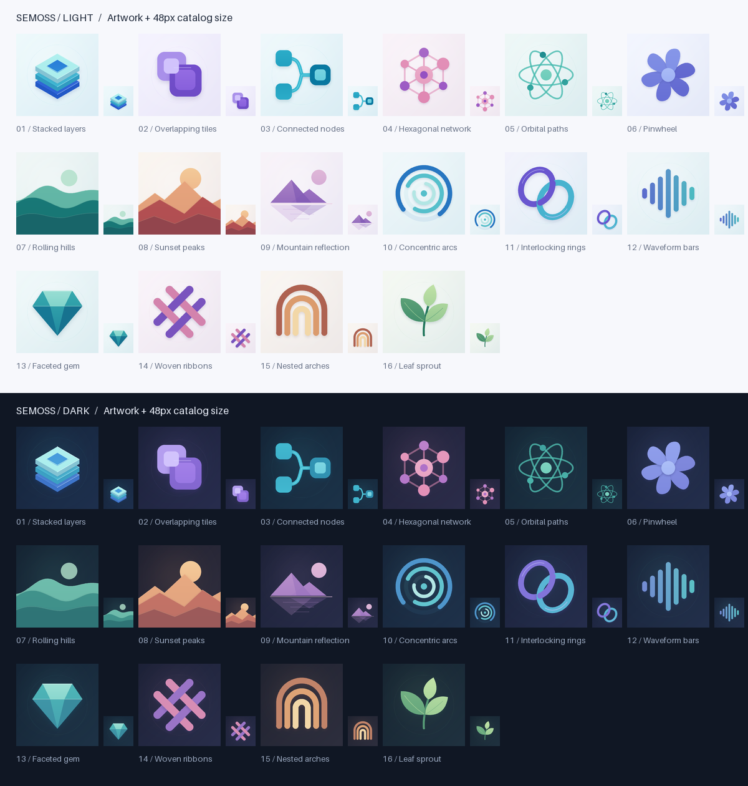
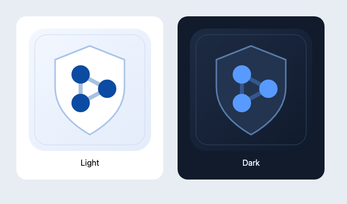
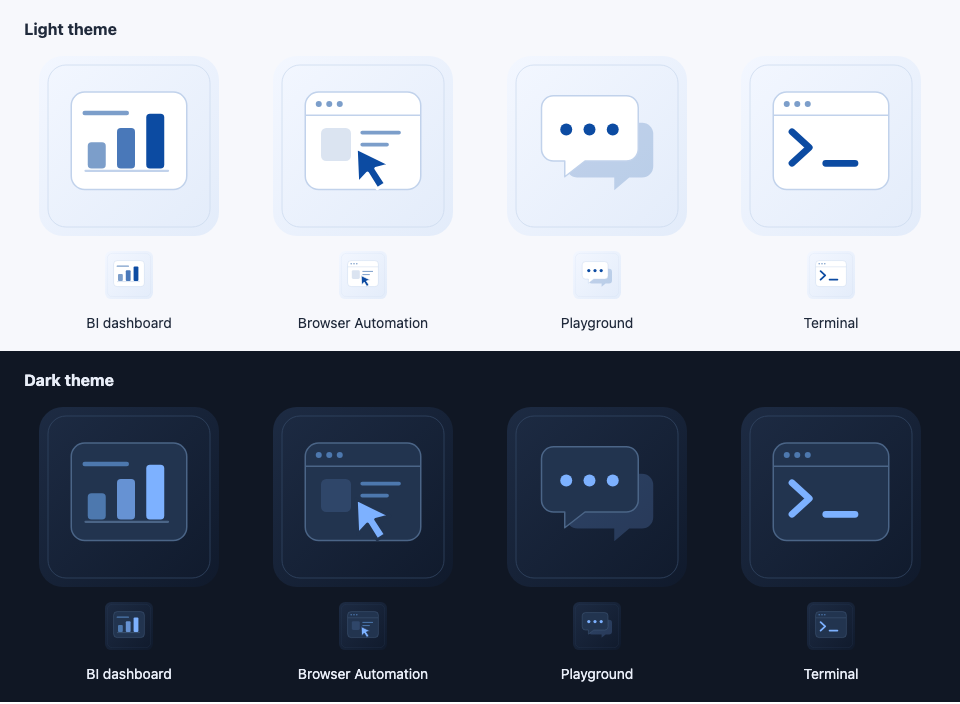

# Catalog image previews

Current artwork in both light and dark themes, including samples at the 48px
catalog size. These preview sheets live outside the stock-image collections so
they are never selected as catalog thumbnails.

## Stock artwork

All 16 designs, generated by [`generate_stock_engine_images.py`](../../utility_scripts/generate_stock_engine_images.py).
Running the script also updates this preview by default.

## Instance-managed projects

The shared shield illustration for registered system projects.

## Built-in system apps

BI, Browser Automation, Playground, and Terminal. These SVGs are maintained in
`semoss-ui/packages/client/src/assets/system-apps/`.

These are the three retained preview sheets. The Python generator updates only
`stock-engines/preview.png`; the two SVG-based sheets are maintained separately.
It does not recreate close-up previews or catalog screenshots.
